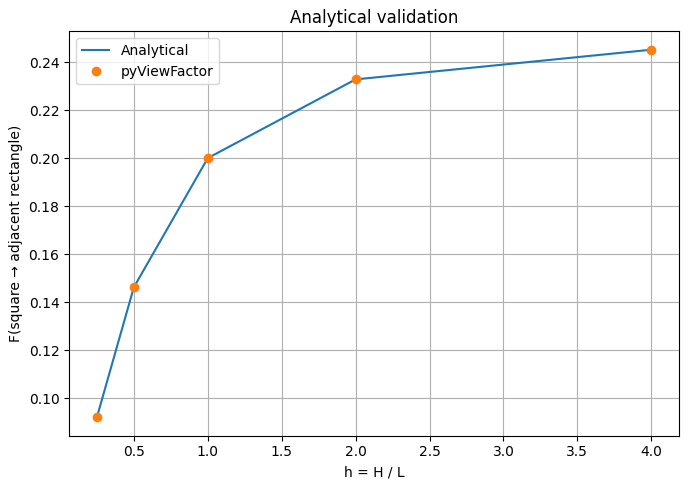
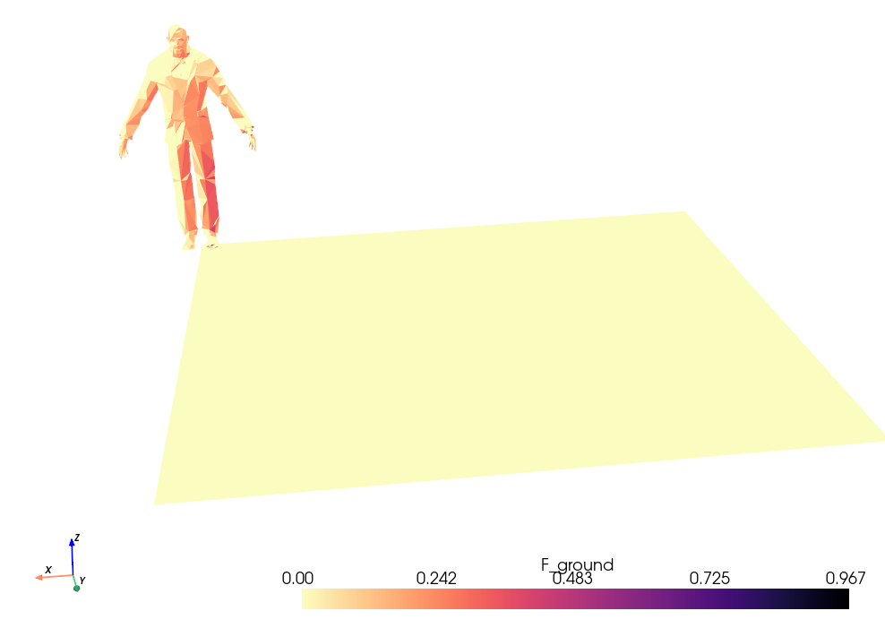
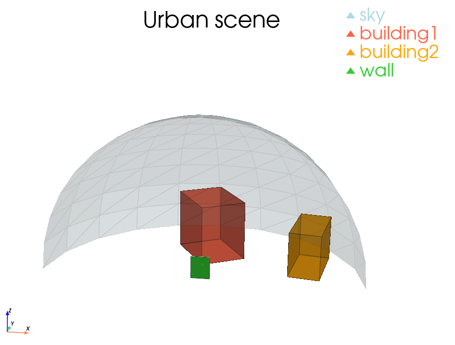
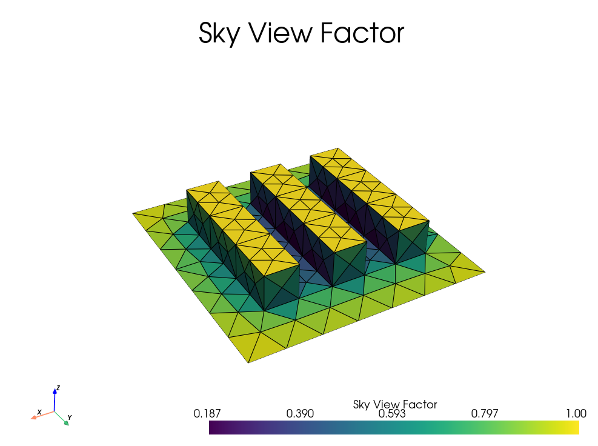
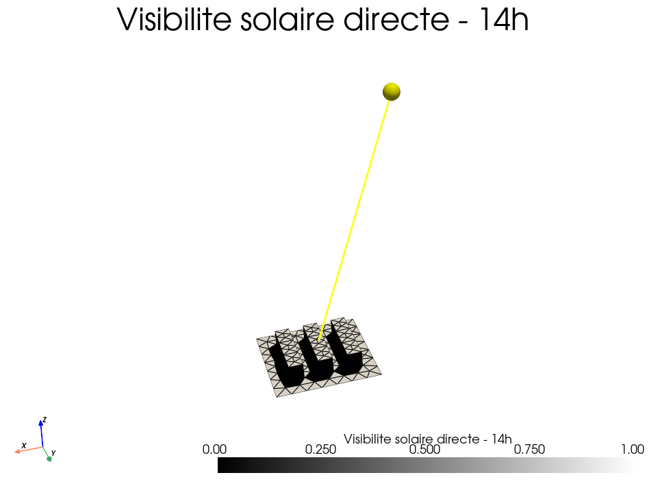
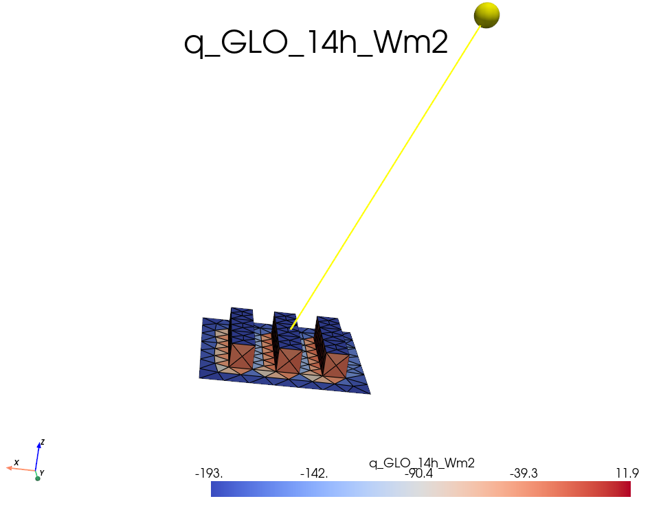

# Exercices - pyViewFactor

Cette page regroupe les exercices pratiques de la formation.
Ils sont pensés pour être lancés comme des scripts Python indépendants, depuis un IDE
comme **Spyder**, **VS Code** ou **PyCharm**, ou dans un **notebook**.

!!! info "Objectif de la séance"
    Passer progressivement d'un cas académique simple à des scènes plus réalistes :
    visibilité, obstruction, validation analytique, discrétisation, matrice complète de
    facteurs de forme, calcul de SVF, flux grande longueur d'onde et export VTK.

## Organisation des scripts

Les scripts du dossier `session/` sont préfixés selon leur rôle pendant la formation.

| Préfixe | Usage prévu | Exemple |
|---|---|---|
| `0_` | Supports de cours utilisés pour expliquer les notions de base | validation analytique, influence de la discrétisation |
| `1_` | Support guidé pour discuter visibilité et obstruction | tests de normales, rayons, obstruction |
| `2_` | Exercices que les participants peuvent lancer seuls | premiers facteurs de forme, cas fermés, scènes urbaines |
| `3_` | Mini-projet réalisé ensemble pas à pas | SVF et flux GLO sur scène urbaine |

### Fichiers sources et scripts de base

Les scripts sont disponibles dans le dossier :

```bash
session/
```

Les géométries, fichiers météo et données associées sont disponibles dans :

```bash
session/src_data/
```

Les sorties générées par le mini-projet sont écrites dans :

```bash
session/output/
```

### Lancer un exercice dans un IDE

1. Ouvrir le dossier du dépôt `simurex2026-pvf` dans l'IDE.
2. Vérifier que l'interpréteur Python sélectionné est bien celui où `pyViewFactor` est installé.
3. Ouvrir un fichier d'exemple dans le dossier `session/`.
4. Vérifier les chemins vers les fichiers de données, par exemple `./session/src_data/...`.
5. Lancer le script avec le bouton **Run** de l'IDE.
6. Observer les sorties :
   - valeurs imprimées dans la console,
   - fenêtres PyVista,
   - figures Matplotlib,
   - fichiers `.vtk`, `.vtp` ou `.pvd` exportés si l'exercice en produit.

!!! warning "Affichage 3D"
    Les exemples utilisant `pyvista.Plotter()` ouvrent une fenêtre interactive. Sur certains environnements distants ou notebooks, il peut être nécessaire de configurer l'affichage graphique.

## 0 - Supports d'explication

Ces scripts servent surtout de support pour introduire les notions et discuter les limites numériques.

### 0.1 - Validation analytique

* Fichier : `0_analytical_comparison.py`
* Description / point clé :
    * comparaison entre une solution analytique et le calcul numérique `pyViewFactor`,
    * cas de deux surfaces adjacentes à 90 degrés,
    * lecture de l'erreur relative selon la géométrie.

* Observer :
    * la courbe analytique,
    * la courbe numérique,
    * les écarts lorsque le rapport géométrique varie.

* Code essentiel :

```python
f_num = pvf.compute_viewfactor(
    rectangle,
    square
)
```

```python
for h in h_values:
    f_ana = analytical_f12_square_to_adjacent_rectangle(h)
    f_num = numerical_f12(h)

    err = abs(f_num - f_ana) / f_ana
    print(h, f_ana, f_num, err)
```





### 0.2 - Influence de la discrétisation

* Fichier : `0_discretization_influence.py`
* Description / point clé :
    * surface courbe approximée par des facettes planes,
    * convergence du facteur de forme lorsque le maillage est raffiné,
    * lien entre géométrie discrétisée et résultat radiatif.

* Observer :
    * évolution de `F(wall -> sphere)`,
    * nombre de facettes visibles,
    * coût de calcul lorsque la résolution augmente.

* Code essentiel :

```python
sphere = pv.Sphere(theta_resolution=res, phi_resolution=res)
sphere.triangulate(inplace=True)

F_total = 0
for i in range(sphere.n_cells):
    facet = pvf.fc_unstruc2poly(sphere.extract_cells(i))

    if pvf.get_visibility(facet, wall)[0]:
        F_total += pvf.compute_viewfactor(facet, wall)
```

!!! note "Message pédagogique"
    `pyViewFactor` calcule entre facettes planes. Une surface courbe n'est donc jamais "continue" dans le calcul : elle est représentée par un ensemble de petits polygones.

## 1 - Visibilité et obstruction

### 1.1 - Comprendre les tests géométriques

* Fichier : `1_understanding_visibility_obstruction.py`
* Description / point clé :
    * visibilité : deux surfaces sont-elles orientées de façon compatible ?
    * obstruction : le segment de vue est-il bloqué par un obstacle ?
    * différence entre les modes `strict=False` et `strict=True`.

* Observer :
    * les normales des faces,
    * les rayons centroïde-centroïde et sommet-sommet,
    * le sens du résultat de `get_obstruction(...)`.

* Code essentiel :

```python
vis = pvf.get_visibility(
    face1,
    face2,
    strict=False
)[0]
```

```python
unobstructed = pvf.get_obstruction(
    face1,
    face2,
    obstacle,
    strict=False
)[0]
```

!!! warning "Convention importante"
    `get_obstruction(...)` retourne `True` lorsque la vue est **non obstruée**. Le nom de la fonction décrit le test effectué, mais la valeur booléenne utile signifie que le chemin est libre.

## 2 - Exercices autonomes

Les exercices `2_...` reprennent les cas pratiques que les participants peuvent lancer seuls. Les objectifs sont les mêmes que dans la version initiale de la page.

### 2.1 - Premier facteur de forme

* Fichier : `2_example_viewfactor.py`
* Description / point clé :
    * cas minimal entre deux surfaces,
    * importance de l'orientation des normales,
    * convention : `compute_viewfactor(receiver, emitter)`.

* Observer :
    * le résultat de `get_visibility`,
    * la valeur du facteur de forme.

* Code essentiel :

```python
import pyvista as pv
from pyviewfactor import get_visibility, compute_viewfactor

rectangle = pv.Rectangle([[0, 0, 0], [1, 0, 0], [0, 1, 0]])
triangle = pv.Triangle([[0, 0, 1], [0, 1, 1], [1, 1, 1]])

if get_visibility(rectangle, triangle)[0]:
    F = compute_viewfactor(triangle, rectangle)
    print("VF rectangle -> triangle :", F)
```


### 2.2 - Visibilité et obstruction

* Fichier : `2_example_obstructions.py`
* Description / point clé :
    * visibilité : orientation des surfaces,
    * obstruction : présence d'un obstacle,
    * `get_obstruction(...)` retourne `True` si la vue est non obstruée.

* Observer :
    * différence `strict=False` / `strict=True`,
    * rayons centroïde vs sommet.

* Code essentiel :

```python
import pyviewfactor as pvf

vis = pvf.get_visibility(face1, face2, strict=False)[0]

unobstructed = pvf.get_obstruction(
    face1, face2, obstacle,
    strict=False
)[0]

if vis and unobstructed:
    F = pvf.compute_viewfactor(face2, face1)
```


### 2.3 - Géométrie fermée

* Fichier : `2_example_closed_geometry.py`
* Description / point clé :
    * vérification de la propriété de somme,
    * lien entre fermeture géométrique et conservation radiative.

* Observer :
    * `sum(F_i) ≈ 1`,
    * différence entre un calcul colonne par colonne et une matrice complète.

* Code essentiel :

```python
import numpy as np

F = np.zeros(mesh.n_cells)

for i in range(mesh.n_cells):
    if i != ref_id:
        face = pvf.fc_unstruc2poly(mesh.extract_cells(i))

        if pvf.get_visibility(face, ref_face)[0]:
            F[i] = pvf.compute_viewfactor(face, ref_face)

print("Sum:", F.sum())
```


```python
Fmat = pvf.compute_viewfactor_matrix(mesh)
print(Fmat[:, ref_id].sum())
```


### 2.4 - Scène avec individu

* Fichier : `2_example_doorman.py`
* Description / point clé :
    * application à une géométrie réaliste,
    * agrégation par type de surface,
    * export VTK.

* Observer :
    * utilisation de `geom_id`,
    * distribution des facteurs de forme sur une géométrie complexe,
    * coût lié au nombre de facettes.

* Code essentiel :

```python
import pyvista as pv
import pyviewfactor as pvf

mesh = pv.read(file)

for idx in doorman_cells:
    face = pvf.fc_unstruc2poly(mesh.extract_cells(idx))

    if pvf.get_visibility(wall, face)[0]:
        F[idx] = pvf.compute_viewfactor(wall, face)
```



### 2.5 - Environnement urbain

* Fichier : `2_example_wall_viewfactors.py`
* Description / point clé :
    * agrégation mur -> ciel / sol / bâtiments,
    * pipeline complet sur une scène urbaine,
    * classification visibilité / obstruction.

* Observer :
    * influence des paramètres `strict`,
    * contributions par famille de surfaces,
    * cohérence des sommes de facteurs de forme.



* Code essentiel :

```python
if pvf.get_visibility(patch, wall)[0]:
    if pvf.get_obstruction(patch, wall, mesh)[0]:
        F += pvf.compute_viewfactor(patch, wall)
```

```python
F_wall_sky = sum(F_patch for patch in sky)
```


### 2.6 - Matrice complète

* Fichier : `2_example_double_loop_vs_matrix.py`
* Description / point clé :
    * comparaison méthode naïve vs matrice complète,
    * performance,
    * export de colonnes de matrice pour visualisation.

* Observer :
    * temps de calcul,
    * écart entre méthodes,
    * intérêt de `compute_viewfactor_matrix(...)`.

* Code essentiel :

```python
F = pvf.compute_viewfactor_matrix(
    mesh,
    obstacles=mesh,
    strict_visibility=True,
    strict_obstruction=True
)
```

## 3 - Mini-projet guidé : SVF et flux GLO

### 3.1 - Objectif

* Fichier : `3_scene_LR_calcul_GLO.py`
* Données :
    * géométrie : `session/src_data/scene_LR_oriented_normals.vtk`,
    * météo : `session/src_data/FRA_AR_Lyon-Bron.AP.074800_TMYx.epw`.

Le mini-projet applique les facteurs de forme à une scène urbaine proche d'un cas canyon. Il est construit en deux parties :

1. calculer le **facteur de vue du ciel** (`SVF`) de chaque maille ;
2. calculer des flux radiatifs grande longueur d'onde sur 24 h, le 18 mai, avec des températures de surface estimées par un modèle 1R1C simplifié.

### 3.2 - Partie 1 : calcul du SVF

La matrice de facteurs de forme est calculée sur toute la géométrie :

```python
F = pvf.compute_viewfactor_matrix(
    mesh,
    obstacles=mesh,
    strict_visibility=False,
    strict_obstruction=False,
)
```

Comme ce calcul peut être coûteux, le script écrit la matrice dans :

```bash
session/output/scene_LR_viewfactor_matrix.npy
```

Si ce fichier existe déjà et que ses dimensions correspondent au nombre de mailles de
la scène, il est rechargé directement. Sinon, la matrice est recalculée puis sauvegardée.

La convention utilisée dans le script est :

```python
F[j, i] = facteur de forme de la maille i vers la maille j
```

Le ciel n'est pas explicitement maillé dans cette scène. On l'estime donc par fermeture :

\[
SVF_i = 1 - \sum_j F_{i \rightarrow j}
\]

Dans le code :

```python
sum_to_scene = viewfactor_matrix.sum(axis=0)
svf = 1.0 - sum_to_scene
```

* Observer :
    * `SVF` proche de 1 pour les surfaces très ouvertes vers le ciel,
    * `SVF` plus faible dans les zones encaissées,
    * éventuels petits dépassements numériques corrigés par `np.clip(...)`.




### 3.3 - Partie 2 : températures de surface

**Pour cet exercice, où nous allons calculer les flux émis par les surfaces, les températures
seront imposées sans calculer les "vrais" échanges radiatifs aevc la méthode des radiosités.**


Les températures de surface ne sont pas imposées arbitrairement.
 Elles sont estimées par un modèle thermique 1R1C explicite, appliqué à chaque maille :

\[
C \frac{dT_s}{dt}
= h_c (T_{air} - T_s)
+ \alpha K_{\downarrow}
+ \varepsilon \sigma (T_{sky}^4 - T_s^4)
+ \frac{k}{e} (T_{core} - T_s)
\]

Avec :

| Terme | Sens |
|---|---|
| \(C = \rho c_p e\) | capacité thermique surfacique active |
| \(h_c\) | coefficient d'échange convectif surface-air |
| \(\alpha\) | absorptivité solaire |
| \(K_{\downarrow}\) | rayonnement solaire incident sur la maille |
| \(\varepsilon\) | émissivité grande longueur d'onde |
| \(T_{sky}\) | température radiative simplifiée du ciel |
| \(k/e\) | couplage conductif vers une couche profonde |

Hypothèses utilisées :

* \(T_{sky} = T_{air} - 15\,^\circ C\),
* \(T_{core}\) est approché par la température moyenne de l'air sur la journée,
* \(h_c = 8\,W.m^{-2}.K^{-1}\),
* pas de temps horaire,
* rayonnement solaire direct corrigé par les masques urbains,
* diffus ciel pondéré par le `SVF`,
* réflexion courte longueur d'onde du sol représentée par un terme isotrope simplifié.

### 3.4 - Matériaux

Les propriétés sont définies dans le dictionnaire `MATERIALS` du script.

| Type | Matériau | \(k\) W/m/K | \(\rho\) kg/m3 | \(c_p\) J/kg/K | \(e\) m | \(\varepsilon\) | \(\alpha\) |
|---|---|---:|---:|---:|---:|---:|---:|
| `ground` | asphalte / sol minéral | 1.2 | 2100 | 920 | 0.08 | 0.95 | 0.85 |
| `facade` | béton / enduit clair | 1.4 | 2200 | 880 | 0.12 | 0.92 | 0.55 |
| `roof` | membrane bitumineuse | 0.8 | 1800 | 1000 | 0.06 | 0.94 | 0.80 |

Ces valeurs sont des ordres de grandeur destinés à l'exercice. L'objectif est de produire une réponse thermique plausible, pas de représenter un bâtiment réel complet.

### 3.5 - Solaire avec pvlib et masques urbains

Le script utilise `pvlib` pour calculer la position solaire à chaque pas horaire.
Le rayonnement incident est ensuite estimé avec une correction géométrique simple :

\[
K_{\downarrow,i}
= DNI \max(0, \vec{n_i}\cdot\vec{s}) V_{sun,i}
+ DHI \, SVF_i
+ \rho_g GHI \frac{1 - \cos(\beta_i)}{2}
\]

avec :

| Terme | Sens |
|---|---|
| \(\vec{n_i}\) | normale de la maille |
| \(\vec{s}\) | direction solaire calculée avec `pvlib` |
| \(V_{sun,i}\) | visibilité directe du soleil : 1 si le rayon n'est pas bloqué, 0 sinon |
| \(SVF_i\) | part de ciel visible par la maille |
| \(\beta_i\) | inclinaison de la maille |
| \(\rho_g\) | albédo du sol |

Le terme direct est donc ombré par la géométrie : pour chaque maille orientée vers
le soleil, un segment est construit depuis le centre de la maille dans la direction
solaire. Le test `is_ray_blocked(...)` de `pyViewFactor` vérifie si ce segment est
intercepté par un triangle de la scène. Si c'est le cas, la maille est considérée à
l'ombre pour la composante directe.

```python
solar_position = pv_location.get_solarposition(times)

sun_vector = solar_vector_from_zenith_azimuth(
    solar_zenith,
    solar_azimuth,
)

incidence_cos = np.maximum(normals @ sun_vector, 0.0)
sun_visible = compute_sun_visibility(
    mesh,
    sun_vector,
    incidence_cos,
    obstacle_triangles,
)

direct = dni * incidence_cos * sun_visible
diffuse_sky = dhi * svf
reflected_ground = ghi * GROUND_ALBEDO * 0.5 * (1.0 - np.cos(tilt_rad))

solaire_incident = direct + diffuse_sky + reflected_ground
```

Les orientations des mailles sont déduites des normales :

* `surface_tilt_deg` : angle par rapport à l'horizontale,
* `surface_azimuth_deg` : azimut selon la convention `pvlib`,
* `SCENE_AZIMUTH_OFFSET_DEG` : correction si l'axe `y` de la scène n'est pas le nord géographique.

!!! warning "Limite du modèle solaire"
    Le direct solaire est masqué par la géométrie, mais le diffus reste représenté
    par une approximation isotrope pondérée par le `SVF`. Le script ne modélise pas
    un ciel anisotrope complet ni les réflexions solaires multiples entre façades.





Ressources utiles :

* [`pvlib.location.Location.get_solarposition`](https://pvlib-python.readthedocs.io/en/stable/reference/generated/pvlib.location.Location.get_solarposition.html)
* [`pyViewFactor` - visibilité et obstruction](https://arep-dev.gitlab.io/pyViewFactor/pyviewfactor/pvf_visibility_obstruction.html)

### 3.6 - Flux grande longueur d'onde

Une fois les températures de surface estimées, le flux GLO net reçu par chaque maille est calculé par :

\[
q_i =
\varepsilon_i \sigma
\left[
\sum_j F_{i \rightarrow j}(T_j^4 - T_i^4)
+ SVF_i (T_{sky}^4 - T_i^4)
\right]
\]

Dans le code, la partie vers les autres surfaces est calculée avec la matrice :

```python
t4 = surface_temperature_k**4
sum_to_scene = viewfactor_matrix.sum(axis=0)

scene_exchange = viewfactor_matrix.T @ t4 - sum_to_scene * t4
sky_exchange = svf * (tsky_k**4 - t4)

q_lw = emissivity * SIGMA * (scene_exchange + sky_exchange)
```

Convention de signe utilisée dans le script :

| Signe de `q_GLO` | Interprétation |
|---|---|
| `q_GLO > 0` | gain radiatif net pour la maille |
| `q_GLO < 0` | perte radiative nette pour la maille |
| `q_GLO ≈ 0` | équilibre radiatif net approximatif sur la maille |

* Observer :
    * zones très ouvertes : influence forte du ciel froid,
    * zones encaissées : couplage plus fort aux surfaces voisines,
    * évolution horaire liée aux températures de surface et au solaire incident.
    * au pas de temps affiché par défaut (`14h`), la sphère jaune indique la direction solaire utilisée pour le calcul du direct.




### 3.7 - Sorties

Le script écrit les résultats dans :

```bash
session/output/
```

Fichiers principaux :

```bash
scene_LR_GLO_18mai_Lyon_all_fields.vtk
scene_LR_GLO_18mai_Lyon.pvd
scene_LR_GLO_18mai_Lyon_steps/*.vtp
```

Champs exportés :

| Champ | Description |
|---|---|
| `SVF` | facteur de vue du ciel par maille |
| `surface_id` | type de surface : sol, façade, toiture, autre |
| `surface_tilt_deg`, `surface_azimuth_deg` | orientation géographique des mailles |
| `K_down_XXh_Wm2` | solaire incident calculé avec `pvlib`, `SVF` et masques urbains |
| `T_surface_XXh_C` | température de surface estimée |
| `q_GLO_XXh_Wm2` | flux GLO net par maille |
| `q_GLO_mean_24h_Wm2` | moyenne 24 h |

Le fichier `.pvd` permet d'ouvrir directement la série temporelle dans ParaView.

Ressources utiles :

* [`pyvista.read`](https://docs.pyvista.org/api/utilities/_autosummary/pyvista.read.html)
* [`pyvista.Plotter`](https://docs.pyvista.org/api/plotting/_autosummary/pyvista.Plotter.html)
* [Documentation pyViewFactor](https://arep-dev.gitlab.io/pyViewFactor/pyviewfactor.html)
