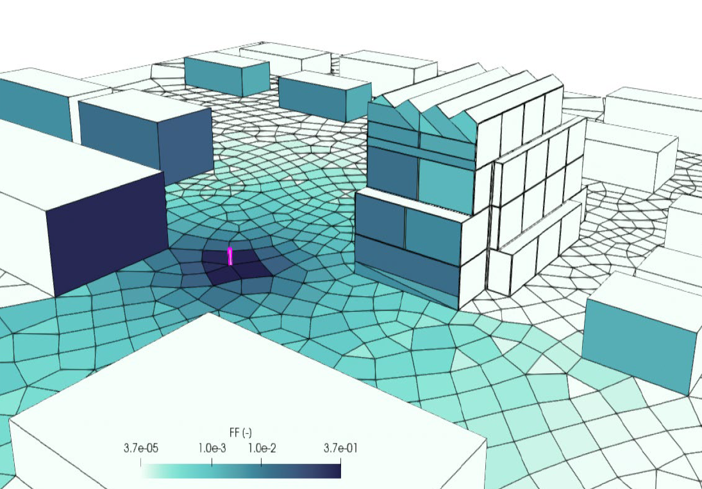

# SIMUREX 2026 – Calcul de facteur de forme et échanges radiatifs

## Ecole thématique SIMUREX, IBPSA 2026

Cette session introduit le calcul des facteurs de forme pour les calculs radiatifs, dans le cadre 
d’applications en thermique et en simulation du bâtiment, avec un accent particulier sur
l’utilisation pratique de la bibliothèque Python `pyviewfactor`.

Ce cours s’inscrit dans le cadre d'une session de formation SIMUREX, associée à 
[IBPSA France 2026](https://conference2026.ibpsa.fr/).

!!! info "Objectif de la session"
    Le contenu combine des éléments de contexte scientifique, ainsi que des exercices pratiques pour apprendre à utiliser `pyViewFactor`.

## Contenu du site

* [Get started](get-started.md) : 
    * Prise en main,
    * Récupérer les sources, 
    * Préparer un environnement Python propre.
* [Rappels scientifiques](scientific-background.md) : 
    * comprendre l’importance des facteurs de vue en thermique,
* [Exercices & mini-projet](exercises.md) : 
    * Travailler sur des problèmes guidés pour comprendre la logique de la librairie, 
    * Cas d'étude,
* [A propos de `pyviewfactor`](about-pyviewfactor.md) : 
    * en savoir plus sur la bibliothèque utilisée durant la session.

---
Mateusz BOGDAN & Edouard WALTHER, with ❤︎