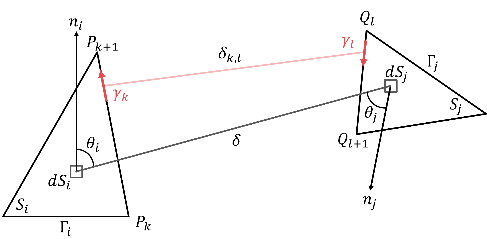

# Rappels scientifiques — Rayonnement et facteurs de forme

## 0. STL / VTK : pourquoi travailler sur des maillages ?

Dans les applications de thermique du bâtiment ou d’environnement urbain, les géométries utilisées proviennent généralement d’outils de modélisation (BIM, CAD, SIG). Ces géométries sont riches mais rarement adaptées directement à des calculs physiques précis.

En pratique, plusieurs difficultés apparaissent :

- les surfaces ne sont pas parfaitement planes,
- les coordonnées contiennent du **bruit numérique** (valeurs proches de zéro mais non nulles),
- les faces peuvent être mal orientées,
- des incohérences topologiques peuvent exister (trous, recouvrements, intersections).

Pour rendre ces géométries exploitables, on les convertit en **maillages surfaciques** (formats STL, VTK), composés de facettes planes (triangles ou polygones).

Cette représentation présente plusieurs avantages :

- elle permet de traiter des géométries arbitraires,
- elle est compatible avec les méthodes numériques d’intégration,
- elle facilite les calculs massivement parallèles.

Cependant, cette étape introduit de nouveaux enjeux :

!!! warning "Impact du maillage"
    Le bruit géométrique, les erreurs d’orientation ou les surfaces quasi coïncidentes ont un impact direct sur les calculs de visibilité, d’obstruction et d’intégration.

Ces aspects doivent donc être explicitement pris en compte dans les algorithmes.

## 1. Rayonnement thermique : bases physiques

Dans les problèmes de thermique du bâtiment, de microclimat urbain et de confort 
thermique, le **rayonnement thermique** joue un rôle central.

Contrairement à la conduction ou à la convection, le rayonnement :

- ne nécessite pas de contact matériel direct,
- dépend fortement de la géométrie,
- couple potentiellement toutes les surfaces visibles entre elles,
- devient très sensible aux masques, aux orientations et aux températures de surface.

!!! info "Idée clé"
    Pour modéliser correctement les échanges radiatifs, il ne suffit pas de connaître les températures : il faut aussi savoir quelles surfaces se voient, et dans quelles proportions.

C'est le rôle des **facteurs de forme** (*view factors*).

### 1.1 Loi de Stefan–Boltzmann

Une surface à température absolue \(T\) émet un flux radiatif. Pour un corps noir, l'émittance totale est donnée par la loi de Stefan–Boltzmann :

$$
E = \sigma T^4
$$

où \(\sigma\) est la constante de Stefan–Boltzmann.

Pour une surface réelle, on introduit généralement une émissivité \(\varepsilon\) :

$$
E = \varepsilon \sigma T^4
$$

### 1.2 Hypothèses usuelles

Dans de nombreux modèles bâtiment et urbains, on fait les hypothèses suivantes :

- surfaces **diffuses** : l'émission est répartie selon la [loi de Lambert](https://fr.wikipedia.org/wiki/Loi_de_Lambert),
- surfaces **grises** : les propriétés radiatives sont moyennées sur le domaine spectral considéré, 
- échanges en **grande longueur d'onde** pour les échanges thermiques entre parois,
- réflexions spéculaires négligées.

Ces hypothèses simplifient fortement les équations tout en restant adaptées à de nombreux cas d'étude.

## 2. Facteurs de forme : géométrie des échanges radiatifs

### 2.1 Définition physique

Le facteur de forme \(F_{i,j}\) représente la **fraction du rayonnement émis par la surface \(i\)** qui atteint directement la surface \(j\).

_Dit autrememnt, \(F_{i,j}\) est la fraction du champ de vision de la facatte \(i\) occupée par la facette \(j\)_

Il dépend de :

- la distance entre les deux surfaces,
- leur orientation relative,
- leur taille,
- leur visibilité,
- la présence éventuelle d'obstacles.

Il ne dépend pas directement des températures.

### 2.2 Formulation intégrale

Pour deux surfaces \(S_i\) et \(S_j\), le facteur de forme s'écrit :

$$
F_{i,j} = \frac{1}{S_i} \iint_{S_i} \iint_{S_j}
\frac{\cos\theta_i \cos\theta_j}{\pi r^2} \, dS_j \, dS_i
$$

où :

- \(r\) est la distance entre deux points des surfaces,
- \(\theta_i\) est l'angle entre la normale à \(S_i\) et la direction reliant les deux points,
- \(\theta_j\) est l'angle équivalent côté \(S_j\).

!!! note "Conséquence"
    Les facteurs de forme sont des grandeurs purement géométriques. Une fois la géométrie fixée, ils peuvent être réutilisés pour différents champs de température.

### 2.3 Propriétés fondamentales

#### Réciprocité

Les facteurs de forme vérifient :

$$
S_i F_{i,j} = S_j F_{j,i}
$$

Cette propriété est très utile numériquement : si l'on connaît \(F_{i,j}\), on peut déduire \(F_{j,i}\) à partir du rapport des aires.

#### Relation de sommation

Pour une surface dans une enceinte fermée :

$$
\sum_j F_{i,j} = 1
$$

Tout le rayonnement quittant la surface \(i\) atteint nécessairement une surface de l'enceinte.

Dans une scène ouverte, la somme peut être inférieure à 1 : une partie du rayonnement peut s'échapper vers le ciel ou l'extérieur du domaine.

#### Additivité

Si une surface \(j\) est découpée en plusieurs sous-surfaces \(j_1, j_2, ...\), alors :

$$
F_{i,j} = F_{i,j_1} + F_{i,j_2} + ...
$$

Cette propriété justifie l'utilisation de maillages : une surface complexe peut être représentée par un ensemble de facettes simples.

## 3. Facteurs de forme et échanges thermiques

Dans un modèle radiatif simplifié entre surfaces diffuses grises, les facteurs de forme permettent de pondérer les échanges entre surfaces.

Une écriture simplifiée du flux net associé à une surface peut prendre la forme :

$$
q_i \propto \sigma \sum_j F_{i,j} \left(T_i^4 - T_j^4\right)
$$

Cette écriture montre que deux surfaces à températures très différentes n'échangent fortement que si elles se voient avec un facteur de forme significatif.

## 4. Lien avec le confort thermique : MRT

### 4.1 Définition

La **température radiante moyenne** (*Mean Radiant Temperature*, MRT) est la température uniforme d'un environnement fictif qui produirait le même échange radiatif avec un individu que l'environnement réel.

Une écriture simplifiée est :

$$
T_r = \left( \sum_i F_i T_i^4 \right)^{1/4}
$$

avec :

- \(F_i\) : facteur de forme entre l'individu et la surface \(i\) ;
- \(T_i\) : température radiative de la surface \(i\).

Cette expression montre que :

- chaque surface contribue proportionnellement à son facteur de forme,
- la géométrie joue un rôle déterminant,
- les effets de masque sont essentiels.

Dans les situations extérieures, un terme lié au rayonnement solaire peut être ajouté selon les conventions du modèle.

### 4.2 Pourquoi c'est important ?

La MRT est souvent l'une des variables les plus influentes dans les indices de confort thermique.

Elle dépend fortement :

- des températures de surface,
- du ciel visible,
- de l'ombrage,
- de la géométrie urbaine,
- de la position de l'individu.

🔗 Ressource complémentaire : [Calcul de MRT](https://lhypercube.arep.fr/thematiques/confort/calcul_mrt/)

!!! info "Lien avec `pyViewFactor`"
    Pour calculer une MRT de manière géométriquement cohérente, il faut connaître les facteurs de forme entre le point ou le corps étudié et les surfaces environnantes.

## 5. Difficultés numériques

Dans des cas simples, il existe des solutions analytiques. Mais dans des géométries réelles, plusieurs difficultés apparaissent :

- surfaces polygonales quelconques,
- orientations variées,
- surfaces adjacentes ou quasi adjacentes,
- masques et obstructions,
- scènes ouvertes,
- grand nombre de paires de surfaces.

Pour un maillage de \(N\) faces, une matrice complète peut contenir \(N^2\) interactions potentielles.

!!! warning "Point numérique"
    Le coût ne vient pas seulement du calcul de l'intégrale. Il vient aussi des tests géométriques : visibilité, obstruction, gestion des cas limites et remplissage de la matrice.

## 6. Méthodes de calcul des facteurs de forme

### 6.1 Méthodes analytiques

Elles donnent des résultats exacts ou quasi exacts pour des configurations simples : plaques parallèles, rectangles perpendiculaires, cylindres, sphères, etc.

Elles sont très utiles pour :

- comprendre les tendances,
- valider un code,
- construire des cas tests.

Limite : elles ne couvrent pas les géométries complexes.

### 6.2 Méthodes Monte Carlo

Le principe est de lancer un grand nombre de rayons depuis une surface et de compter les intersections avec les autres surfaces.

Avantages :

- méthode très générale,
- gestion naturelle des obstructions,
- adaptée à des scènes complexes.

Limites :

- bruit statistique,
- convergence parfois lente,
- besoin d'un grand nombre de rayons pour les faibles facteurs de forme.

### 6.3 Méthodes hémicube ou raster

Ces méthodes projettent la scène sur un hémicube ou une discrétisation angulaire autour d'une surface.

Avantages :

- efficaces dans certains contextes graphiques,
- gestion possible des masques.

Limites :

- précision dépendante de la résolution,
- artefacts de discrétisation,
- moins adaptées lorsque l'on cherche une formulation numérique contrôlée.

### 6.4 Intégration numérique directe

On peut calculer directement l'intégrale surfacique :

$$
F_{i,j} = \frac{1}{S_i} \iint_{S_i} \iint_{S_j}
\frac{\cos\theta_i \cos\theta_j}{\pi r^2} \, dS_j \, dS_i
$$

Cette approche est générale, mais coûteuse : elle nécessite une intégration sur deux surfaces.

### 6.5 Transformation en intégrale de contour

Pour des polygones plans, il est possible de transformer l'intégrale de surface en intégrale de contour.

L'idée est de remplacer l'intégration sur les surfaces par une somme d'intégrales associées aux paires d'arêtes. 

!!! success "Lien avec la formation"
    C'est cette famille de méthodes qui est utilisée dans `pyViewFactor` : elle est bien adaptée aux facettes planes issues de maillages.

{width="100%"}

L'idée clé provient de **Mazumder _et al._, 2012**[^1] qui permettent de passer de la première intégrale ci-dessous à la seconde : 

\begin{equation}\label{eq:dbl_integral}
F_{i,j} = \frac{1}{S_i} \iint_{S_i} \iint_{S_j}  \frac{\cos(\theta_i)\cos(\theta_j)}{\delta^2} \,dS_j \,dS_j
\end{equation}

\begin{equation}\label{eq:cont_integral}
F_{i,j} = \frac{1}{2\pi S_i} \oint_{\Gamma_i} \oint_{\Gamma_j}  \ln(\delta_{k,l}) \,d\gamma_l \,d\gamma_k
\end{equation}

Dans cette seconde intégrale, en opérant un changement de variable : 

$$
\begin{cases}
d\overrightarrow{\gamma_{k,k+1}} = \overrightarrow{P_k P_{k+1}} \, d\lambda_P \\
d\overrightarrow{\gamma_{l,l+1}} = \overrightarrow{Q_l Q_{l+1}} \, d\lambda_Q
\end{cases}
$$

Et en décomponsant la distance \(\delta_{k,l}\) : 

$$
\overrightarrow{\delta_{k,l}} =
\overrightarrow{P_k Q_l}
+ \lambda_Q \, \overrightarrow{Q_l Q_{l+1}}
- \lambda_P \, \overrightarrow{P_k P_{k+1}}
$$

On se retourve à devoir intégrer le \(log \) d'un polynôme de degré 2, entre 0 et 1. _Et là de nombreuses méthodes numériques existent !_

Plus de détails [ici](https://www.researchgate.net/publication/360835982_Calcul_des_facteurs_de_forme_entre_polygones_-Application_a_la_thermique_urbaine_et_aux_etudes_de_confort), dans la papier IBPSA 2022 !
 
[^1]: Mazumder and Ravishankar, 2012, __General procedure for calculation of diffuse view factors between arbitrary planar polygons__ [DOI](https://www.sciencedirect.com/science/article/pii/S0017931012006023)

# 7. Intégration numérique : dblquad vs Gauss–Legendre

Une fois l'intégrale transformée en intégrale de contour, le problème ne disparaît pas : il change de nature.

On se retrouve à devoir évaluer une intégrale de la forme :

- double intégrale sur les paramètres \(\lambda_P\) et \(\lambda_Q\),
- d’une fonction contenant un \(\log(\delta_{k,l})\),
- où \(\delta_{k,l}\) est une fonction polynomiale du second degré.

Autrement dit, même après réduction surface → contour, il reste une **intégration numérique non triviale**.

---

### 7.1 Intégration adaptative (type `dblquad`)

Une première approche consiste à utiliser un intégrateur adaptatif, comme `scipy.integrate.dblquad`.

Principe :

- l'intégrale est évaluée de manière récursive,
- la précision est contrôlée automatiquement,
- les zones "difficiles" sont raffinées.

Avantages :

- très robuste,
- gère naturellement les cas dégénérés (arêtes communes, sommets partagés),
- peu sensible aux singularités locales.

Limites :

- coût computationnel élevé,
- difficile à utiliser pour des matrices complètes de grande taille,
- dépendance à SciPy.

!!! info "Interprétation"
    Cette approche peut être vue comme une "référence numérique" : lente mais fiable.

---

### 7.2 Quadrature de Gauss–Legendre

Une alternative consiste à utiliser une quadrature de Gauss–Legendre sur \([0,1]\).

Principe :

- l'intégrale est approximée par une somme pondérée :
  $$
  \int_0^1 f(\lambda) d\lambda \approx \sum_i w_i f(x_i)
  $$
- les points \(x_i\) et poids \(w_i\) sont optimisés pour maximiser la précision.

Dans notre cas :

- la double intégrale devient une double somme,
- le coût est fixe pour un ordre donné,
- l’implémentation est très efficace avec des boucles compilées (Numba).

Avantages :

- très rapide,
- parfaitement déterministe,
- bien adaptée aux calculs massifs (matrices complètes).

Limites :

- précision dépend du nombre de points,
- moins robuste lorsque les surfaces sont très proches ou adjacentes,
- nécessite une bonne gestion des cas limites.

### 7.3 Stratégie hybride

Dans la pratique, aucune des deux méthodes ne suffit seule.

Une stratégie efficace consiste à :

- utiliser **Gauss–Legendre** pour les surfaces disjointes (cas majoritaires),
- basculer vers **dblquad** pour les cas difficiles :
  - surfaces adjacentes,
  - partage de sommet,
  - proximité géométrique.

!!! success "Idée clé"
    Cette approche permet de conserver la performance globale tout en garantissant la robustesse dans les cas critiques.

## 8. Ce qu'il faut retenir avant la pratique

À ce stade, les messages importants sont :

1. Le rayonnement thermique dépend fortement de la géométrie.
2. Les facteurs de forme décrivent cette dépendance géométrique.
3. Ils sont essentiels pour les échanges radiatifs et la MRT.
4. Leur calcul devient difficile dans les scènes maillées avec obstructions.
5. `pyViewFactor` propose une approche numérique dédiée aux facettes planes.
