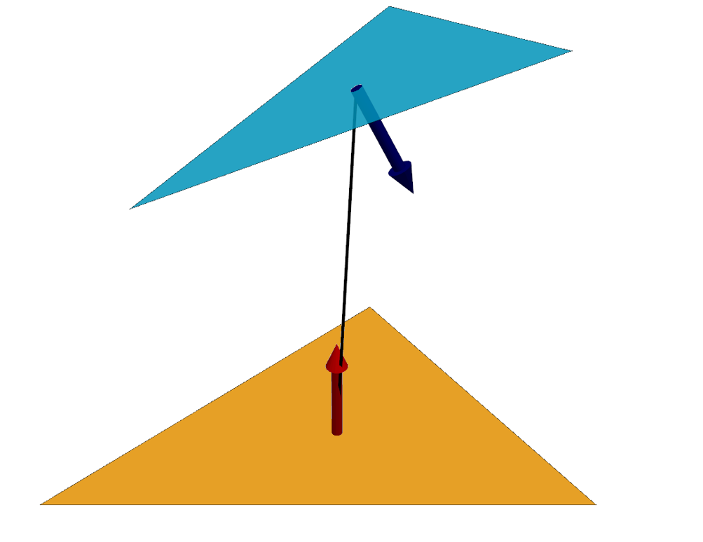
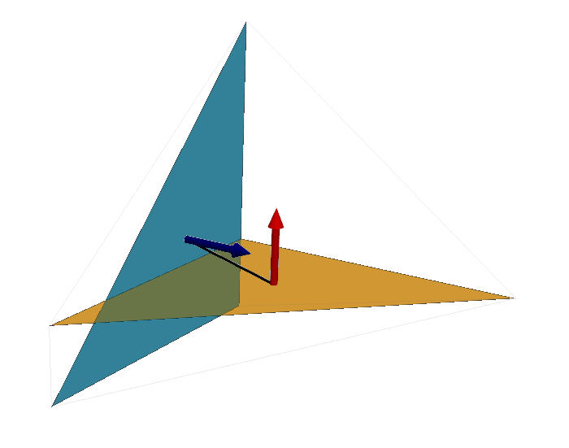
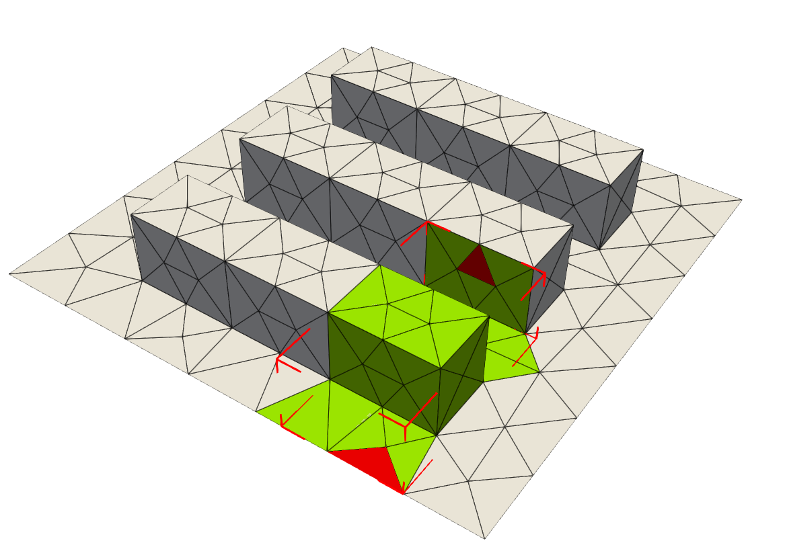
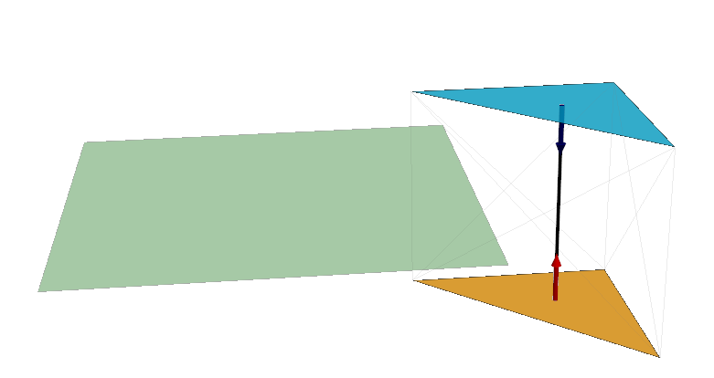

# Tests de visibilité et d'obstruction

!!! success "Comprendre par l'exemple"
    Le fichier `1_understanding_visibility_obstruction.py` permet de comprendre les différentes stratégies décrites ci-dessous avec des exemples. 

## 1. Introduction

Le calcul des facteurs de forme ne repose pas uniquement sur une intégration numérique.  
Avant même d'évaluer une intégrale, il est nécessaire de déterminer si deux surfaces :

- peuvent **géométriquement se voir** (visibilité),
- sont **effectivement visibles sans obstacle** (obstruction).

Ces deux étapes sont fondamentales car elles permettent :

- de réduire fortement le nombre de calculs,
- d'éviter des intégrations inutiles,
- de garantir la cohérence physique des résultats.

!!! info "Pipeline"
    Dans `pyViewFactor`, ces tests sont effectués **avant toute intégration**, et conditionnent directement le calcul des facteurs de forme.

## 2. Test de visibilité

!!! abstract "Implémentation"
    `get_visibility(cell_1, cell_2, ...)`
    

### 2.1 Principe

Le test de visibilité consiste à vérifier si deux facettes sont **orientées l'une vers l'autre**.

<figure>
  
        
  <figcaption>
    Orientation relative entre facettes
  </figcaption>
</figure>

Autrement dit, même en l'absence d'obstacles, deux surfaces ne peuvent échanger du rayonnement que si :

- leurs normales sont orientées de manière compatible,
- leurs centres sont mutuellement visibles.

### 2.2 Formulation géométrique

Soient deux facettes \(S_i\) et \(S_j\), de centres \(C_i\) et \(C_j\), et de normales \(\vec{n}_i\), \(\vec{n}_j\).

On considère le vecteur :

$$
\vec{v}_{ij} = C_i - C_j
$$

Les conditions de visibilité s'écrivent :

$$
\vec{v}_{ij} \cdot \vec{n}_j > 0
\quad \text{et} \quad
\vec{v}_{ij} \cdot \vec{n}_i < 0
$$

Ces deux conditions garantissent que :

- \(S_j\) est orientée vers \(S_i\),
- \(S_i\) est orientée vers \(S_j\).

### 2.3 Interprétation

Ce test revient à vérifier que :

- chaque surface "regarde" l'autre,
- les normales ne sont pas divergentes.

### 2.4 Modes strict et non strict

Dans la pratique, deux stratégies existent :

#### Mode non strict

- basé sur les centroïdes,
- rapide,
- tolère les cas partiellement visibles.

#### Mode strict

- vérifie tous les points des facettes,
- rejette les cas partiellement visibles,
- plus conservatif.

<figure>
  
        
  <figcaption>
    Strict = True, facettes non visibles ; Strict = False, facettes visibles
  </figcaption>
</figure>

!!! warning "Cas limites"
    Dans les géométries réelles, une facette peut être partiellement visible. Le choix du mode strict dépend de l'application.

## 3. Test d'obstruction

!!! abstract "Implémentation"
    `get_obstruction(cell1, cell2, obstacle, ...)`

### 3.1 Principe

Même si deux surfaces sont orientées correctement, elles peuvent être **masquées par une troisième surface**.

Le test d'obstruction consiste à vérifier que le segment reliant les deux surfaces ne coupe aucun obstacle.

### 3.2 Formulation

On considère un rayon entre deux points :

$$
\vec{r}(t) = (1 - t) \, P + t \, Q
\quad \text{avec} \quad t \in (0,1)
$$

Le problème devient :

> Existe-t-il une intersection entre ce segment et une autre facette ?

### 3.3 Algorithme utilisé

Une méthode classique est l'algorithme de [**Möller–Trumbore**](https://en.wikipedia.org/wiki/M%C3%B6ller%E2%80%93Trumbore_intersection_algorithm) :

- test rapide d'intersection rayon-triangle,
- robuste numériquement,
- adapté aux maillages triangulés.

### 3.4 Filtrage spatial et accélération BVH

Pour éviter de tester toutes les facettes, un filtrage spatial est appliqué avant le test de Möller–Trumbore.

#### Boîte englobante AABB (principe de base)

Une première approche consiste à construire une **boîte englobante commune** aux deux faces testées (AABB — *Axis Aligned Bounding Box*), et à ne retenir que les triangles obstacles qui la recoupent.

<figure>
  
        
  <figcaption>
    Le calcul d'obstruction entre les deux facettes rouges ne parcourt que les facettes vertes, contenues dans la AABB.
  </figcaption>
</figure>

Ce filtre est efficace mais ne résout qu'un seul niveau de découpage : les triangles restants sont ensuite testés **séquentiellement**, un par un — coût **O(N)** par rayon.

#### BVH : hiérarchie de boîtes englobantes (v1.1.0)

Depuis la v1.1.0, `pyViewFactor` construit une **BVH** (*Bounding Volume Hierarchy*) sur le maillage obstacle : un **arbre binaire de boîtes AABB**, où chaque nœud contient exactement les triangles de son sous-arbre.

Principe de la traversée pour un rayon donné :

1. Tester le rayon contre la boîte du nœud racine (*slab test* : 6 comparaisons),
2. **Raté** → tout le sous-arbre est éliminé, zéro triangle testé,
3. **Touché** → descendre dans les deux fils,
4. À la feuille → test de Möller–Trumbore sur le triangle.

Chaque niveau élimine environ la moitié des candidats restants : le coût passe de **O(N)** à **O(log N)** par rayon. L'arbre est stocké sous forme de tableaux NumPy plats (sans objets Python) pour rester compatible avec la compilation Numba.

!!! success "Optimisation clé"
    Sur un maillage urbain de 382 faces, la combinaison BVH + Numba `prange` contribue à un gain global de **×33** par rapport à la v1.0.

### 3.5 Modes strict et non strict

#### Mode non strict

- un seul rayon (centroïde → centroïde),
- rapide,
- approximation.

#### Mode strict

- rayons entre tous les sommets,
- plus précis,
- plus coûteux.

<figure>
  
        
  <figcaption>
    Strict = True, obstruction présente ; Strict = False, pas d'obstruction
  </figcaption>
</figure>

## 4. Difficultés pratiques

### 4.1 Bruit géométrique

Les données issues de CAD contiennent souvent :

- des coordonnées quasi nulles,
- des arêtes non parfaitement partagées,
- des décalages minimes.

Ces défauts peuvent conduire à :

- des faux positifs d'obstruction,
- des incohérences de visibilité.

### 4.2 Cas dégénérés

Certains cas sont particulièrement sensibles :

- surfaces partageant une arête,
- surfaces partageant un sommet,
- surfaces quasi coplanaires,
- distances très faibles.

### 4.3 Gestion numérique

Plusieurs solutions sont utilisées :

- arrondi des coordonnées,
- introduction d'un seuil \(\varepsilon\),
- exclusion des intersections aux extrémités,
- filtrage des triangles identiques.
